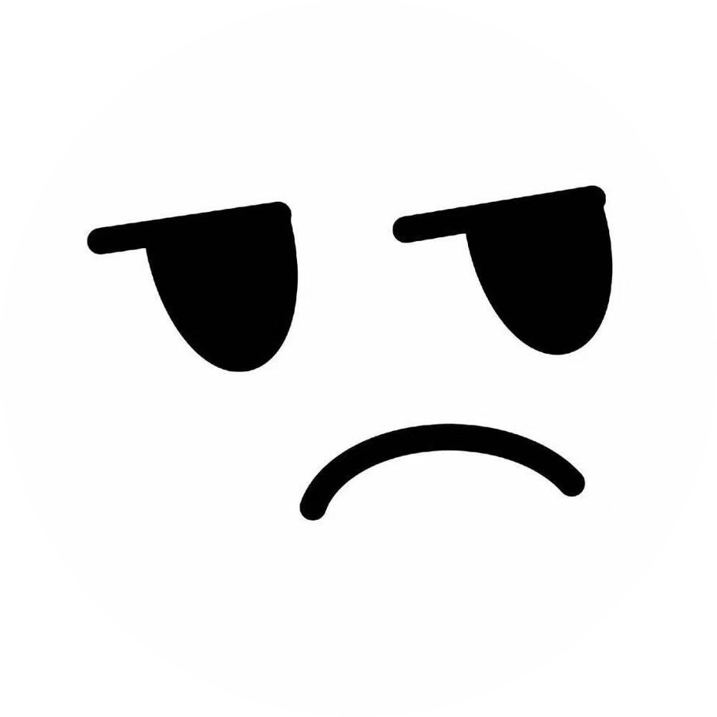

    

        
        <h1 class="profile-name">{{ site.title }}</h1>
        
{{ site.description }}

    

    

        

            
Hi! I'm Warnstein — welcome to my personal blog.

            
Here, I document my study notes, technical explorations, and reflections on life. I’m passionate about programming, enjoy diving into new technologies, and appreciate the process of capturing my thoughts through writing.

            
I hope the content here can be helpful to you, and you're always welcome to reach out and discuss ideas with me!

        

    

    <h2>博客文章</h2>
    

        <!-- 单篇文章 -->
        <a href="/about" class="blog-item">
            <h3>📄 关于我</h3>
            
个人简介与联系方式

        </a>
        <!-- 文件夹：Wiki 笔记 -->
        

            

                <h3>📁 Wiki 笔记</h3>
                
技术文档与学习笔记集合

            

            

                <a href="/wiki/intro" class="blog-item-nested">
                    <h4>Wiki 简介</h4>
                    
纯文本风格的 Wiki 模板介绍

                </a>
                <!-- 继续在该文件夹下添加笔记 -->
                <a href="/wiki/example" class="blog-item-nested">
                    <h4>示例页面</h4>
                    
Markdown 使用示例与代码演示

                </a>
            

        

        

         

                <h3>CSAPP</h3>
                
Computer System A Programmmer's Perspective

            

            

                <a href="/CSAPP/intro" class="blog-item-nested">
                    <h4>CSAPP introduce</h4>
                    
Introduction

                </a>
            

        

        <!-- 可以继续添加更多文章或文件夹 -->
    

