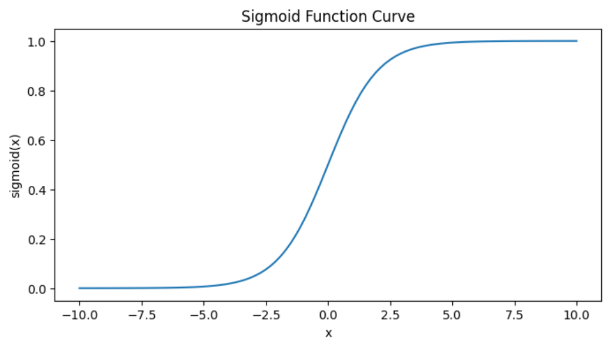
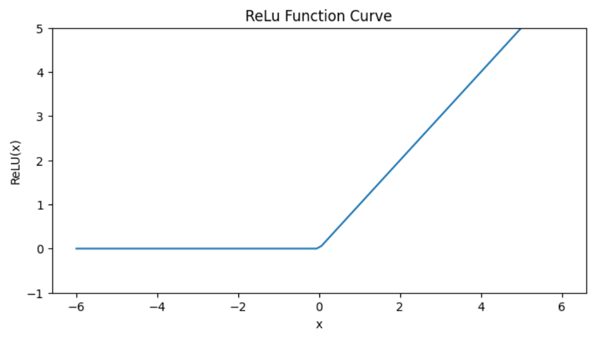

目标🎯：
- 掌握对于激活函数而言的`numpy`和`matplotlib`库的基本操作
- 掌握对多维数组操作的`numpy`基础`api`
- 明白激活函数的作用
- 明白四种激活函数的具体作用及各个的优缺点
- 知道目前主流使用哪个激活函数以及为什么其他的会被淘汰
- 会看见公式写代码
- 在多层神经网络中，弄清楚且快速反映出下标的作用
- 能够熟练写出简单的多呈神经网络

# 基本的`numpy` && `matplotlib`库的使用

我在这里就简单说一下我目前在鱼书中用到的几个`numpy`和`matplotlib`的[API](https://github.com/Warnstein001/ml_to_cs336/blob/master/2_dl_from_scratch/%E7%AC%AC%E4%B8%89%E7%AB%A0%EF%BC%9A%E6%BF%80%E6%B4%BB%E5%87%BD%E6%95%B0.ipynb)

```python
# numpy
import numpy as np
np.exp(-x) # e^{-x}
x = np.array([1, 2, 4, 5]) # 创建一个数组
np.array(x > 0, dtype=np.int_) # x > 0 这个二判断条件会把 x 中的值转换成 bool 值，然后再 dtype=np.int_ 将其转换成 0 1 -- false true
np.arrange(-5.0, 5.0, 0.1)
np.linspace(-10, 10, 100) # 创建等间隔的值——在这里代表在[-10, 10]中生成等间隔的100个值
np.where(x > 10, 1, 0) # 这个就类似于三目运算符
# matplotlib
import matplotlib.pylab as plt
plt.figure(figsize=(8, 4)) # 设置画布大小
plt.plot(x, y) # 绘制Sigmoid曲线
plt.title("title") # 标题
plt.xlabel('x') # x轴标签
plt.ylabel('f(x)') # y轴标签
plt.ylim(-1, 5) # 设置 y 轴的范围
plt.show() # 显示图像
```

# 激活函数 -- 隐藏层

在感知机那小节中，我们知道：偏置被用于控制神经元被激活的容易程度

**函数是连接感知机和神经网络的桥梁**

## Sigmoid Function

### 公式入下：

$$
h(x)=\frac{1}{1-e^{-x}}
$$

### 函数图像：



>  从上图我们可以看到其输入值和输出值永远在 0 和 1 之间

### 代码实现：

```python
def sigmoid_function(x):
    return 1 /(1 + np.exp(-x))
```

### 主要作用（为什么用它）

**（1）最早用于二分类问题的输出层**

这是它最经典、最重要的用途！

比如你要判断一张图片是不是猫（是猫=1，不是猫=0），网络最后一层通常会接一个sigmoid：

- 输出 0.88 → 模型认为88%概率是猫
- 输出 0.23 → 模型认为只有23%概率是猫

因为它能把任意实数“压缩”到[0,1]区间，天然可以解释成概率，非常直观。

**（2）引入非线性**

没有激活函数的神经网络，不管多少层，最后都等价于单层线性模型（没用）。 Sigmoid是非线性的，能让神经网络拟合复杂的非线性关系。

### 优点（为什么以前特别流行）

- 输出范围在(0,1)，方便解释为概率
- 连续可导，导数计算简单： $σ′(x)=σ(x)(1−σ(x)) $只需要用输出值本身就能算导数，实现起来很优雅

### 缺点（为什么现在很少在隐藏层用了）

- 梯度消失问题：当输入很大或很小时，梯度接近0，导致深层网络几乎学不到东西（尤其是早期的深层网络）
- 输出不以0为中心（总是正数），会让下一层的权重更新方向一致，收敛慢
- 包含`exp`运算，计算相对慢一点

### 现在还在用的场景

1. 二分类问题的输出层（尤其是早期的模型，或者教学演示）
2. 某些门控单元（比如LSTM、GRU里的部分gate，虽然现在也有用其他函数的变种）
3. 需要输出概率且范围必须严格在(0,1)之间的任务
4. 一些生成模型或强化学习中的策略网络（输出动作概率）

### 总结

Sigmoid最核心的作用就是：把任意实数映射到(0,1)区间，最适合用来做二分类任务的概率输出。

## Step Function

### 公式如下：

$$
y=
\begin{cases}
1, \quad x>0 \\
0,\quad x\leq 0
\end{cases}
\tag{1}
$$

#### Wiki百科上的通式如下：

$$
y=
\begin{cases}
1, \quad x \in A_i \\
0,\quad x\notin A_i
\end{cases}
\tag{1}
$$

### 函数图像：


### 代码实现：

```python
def step_function(x):
    return np.where(x > 0, 1, 0)
```

### 2. 优点（为什么它会出现？历史必然性）

- 最符合生物神经元“激发/不激发”的直觉（麦卡洛克-皮茨模型，1943年）
- 完美实现二分类：输出1表示“是这一类”，输出0表示“不是这一类”
- 计算和硬件实现极其简单（早期计算机资源极度匮乏时，这是唯一可行的选择）
- 感知机（Perceptron，1958年Frank Rosenblatt）就是靠它一举成名的——单层感知机可以完美解决线性可分问题（当时轰动一时）

一句话：阶跃函数是“最早能让机器实现模式分类”的激活函数，开启了整个神经网络时代。

### 3. 致命缺点（为什么它被迅速淘汰）

| 缺点                   | 具体表现                                                     | 后果                                             |
| ---------------------- | ------------------------------------------------------------ | ------------------------------------------------ |
| 几乎处处不可导         | 在x=0处导数无定义，其他地方导数恒为0                         | 完全无法使用基于梯度的优化算法（即无法反向传播） |
| 梯度恒为0              | 反向传播时梯度永远是0                                        | 多层网络根本学不到任何东西（只能训练单层）       |
| 输出是离散的0/1        | 不能表示“不确定性”或概率                                     | 不利于软决策和复杂任务                           |
| 无法解决非线性可分问题 | 经典例子：XOR问题完全无能为力（Minsky 1969年《Perceptrons》证明） | 直接导致了第一次AI寒冬（1970年代）               |

### 4. 总结（三句话记住一辈子）

- 阶跃函数是神经网络的“远古祖先”，让人类第一次看到机器能像人脑一样做分类决策。
- 但因为“导数几乎处处为0”，它彻底无法训练多层网络，被钉在了历史的耻辱柱上。
- 正是因为阶跃函数的失败，才逼出了后来的Sigmoid → ReLU的进化之路——没有它的死胡同，就没有今天的深度学习。

### 5. 现在唯一存在的场景（2025年）

- 只在教学和理论推导中出现，用来对比“为什么需要可导的激活函数”
- 偶尔出现在“硬注意力（hard attention）”或某些极端量化网络中（几乎不常见）

## ReLU Function

### 公式如下：

$$
y=
\begin{cases}
x, \quad x>0 \\
0,\quad x\leq 0
\end{cases}
\tag{1}
$$

### 函数图像：



### 代码实现：

```python
def ReLU(x):
    return np.maximum(0, x)
```

### 为什么ReLU这么火？（6个核心优点）

| 优点                 | 解释                                                         |
| -------------------- | ------------------------------------------------------------ |
| 计算极快             | 只需要一个max操作，不像sigmoid/tanh有昂贵的`exp`             |
| 完全解决梯度消失问题 | 在x>0区域，导数恒为1，无论网络多深，梯度都能正常传播         |
| 加速收敛             | 实际训练速度比sigmoid/tanh快好几倍（AlexNet那篇论文实测快6倍） |
| 稀疏激活             | 负数输入直接变成0，很多神经元“关闭”，带来天然的稀疏性，有助于减少过拟合 |
| 生物学合理性         | 更接近生物神经元的“单侧抑制”特性                             |
| 实现简单             | 代码就一行                                                   |

### 缺点（也有，但可接受）

| 缺点                   | 解释                                                         | 解决办法（常用的变种）                  |
| ---------------------- | ------------------------------------------------------------ | --------------------------------------- |
| Dying ReLU（死亡ReLU） | 负数区域梯度永远为0，一旦神经元进入负区就再也激活不了，可能“死掉” | Leaky ReLU、P-ReLU、ELU                 |
| 输出不以0为中心        | 全是≥0的值，可能会让梯度更新偏向一个方向                     | 用Batch Normalization基本解决了这个问题 |

### 常见的ReLU家族变种（你迟早都会遇到）

| 变种                     |                公式                |                       特点                       |
| ------------------------ | :--------------------------------: | :----------------------------------------------: |
| Leaky ReLU               |     f(x) = x if x>0 else 0.01x     |                                                  |
| P-ReLU                   | f(x) = x if x>0 else ax（a可学习） |       负区斜率由网络自己学，比固定0.01更好       |
| ReLU6                    |          min(max(0,x), 6)          |         输出上限6，在移动端量化时更友好          |
| ELU                      |      x if x>0 else α(e^x -1)       |         负区是指数曲线，输出均值更接近0          |
| GELU（高斯误差线性单元） |     x ⋅ Φ(x)（Φ是正态分布CDF）     | 当前Transformer模型（BERT、GPT等）最爱的激活函数 |

### 实际使用指南

- 隐藏层：99%的情况直接用ReLU就行（或者Leaky ReLU更保险）
- CNN（卷积神经网络）：几乎100%用ReLU及其变种
- Transformer：基本都用GELU或Swish
- 输出层：回归问题直接线性或ReLU（预测非负值时），分类问题用softmax（多分类）或sigmoid（二分类）
- 永远不要在ReLU后加Batch Normalization，效果更好

### 一句话总结：

ReLU的伟大之处在于——它用最简单的方式（max(0,x)）几乎完美解决了sigmoid时代最头疼的梯度消失问题，让我们今天能轻松训练上百上千层的深度网络。

你现在看到的几乎所有SOTA（最先进）模型（ResNet、ViT、YOLO、Diffusion、LLaMA等），隐藏层基本都是ReLU家族的功劳。

## 总结

> 这里我以“为什么教材上会以这个顺序讲解这个问题为想到问的AI”

### 1. 这三个激活函数在隐藏层的使用情况（当前2025年的真实现状）

| 激活函数     | 是否主要用于隐藏层？     | 现在（2025年）还在隐藏层大规模使用吗？ | 备注                                               |
| ------------ | ------------------------ | -------------------------------------- | -------------------------------------------------- |
| 阶跃函数     | 历史上是（感知机时代）   | 完全不用                               | 不可导，无法反向传播，只用于教学演示               |
| Sigmoid      | 曾经是（1980s~2010左右） | 几乎不用（极少例外）                   | 梯度消失太严重，深层网络训不动                     |
| ReLU及其变种 | 是！到现在仍然是主力     | 大量使用（隐藏层默认选择）             | ReLU/Leaky ReLU/PReLU/GELU/Swish 占据了99%的隐藏层 |

所以严格来说，现在只有 ReLU 家族才是真正“主要用于隐藏层”的激活函数，阶跃和 Sigmoid 只是作为“历史对照”出现在隐藏层章节，用来讲解“为什么我们需要更好的激活函数”。

### 2. 为什么教材把它们三个放在隐藏层章节？

因为这本书（白皮书）和很多经典教材是按照历史发展顺序来讲的：

1. 第一代：感知机 → 隐藏层用阶跃函数（但是只能单层）
2. 第二代：多层感知机（MLP）+ BP算法 → 隐藏层开始用 Sigmoid/tanh（终于能多层了）
3. 第三代：深度学习时代（2012年后） → 隐藏层改用 ReLU 才能训得很深的网络

所以作者把“隐藏层激活函数的演进”放在一起讲，帮助你理解“为什么 ReLU 能彻底取代前两者”。

### 3. 输出层 vs 隐藏层的激活函数分工（2025年标准实践）

| 层位置 | 任务类型             | 常用激活函数                  | 原因                         |
| ------ | -------------------- | ----------------------------- | ---------------------------- |
| 隐藏层 | 提取特征、引入非线性 | ReLU、Leaky ReLU、GELU、Swish | 训练快、不梯度消失、稀疏性好 |
| 输出层 | 回归                 | 无（线性）或 ReLU（输出≥0时） | 直接预测连续值               |
| 输出层 | 二分类               | Sigmoid                       | 输出0~1概率                  |
| 输出层 | 多分类               | Softmax                       | 多个概率和为1                |
| 输出层 | 多标签分类           | Sigmoid（多位置独立）         | 每个类别独立概率             |

注意：现在 Sigmoid 只在输出层（二分类或多标签）还有一席之地，在隐藏层几乎绝迹了。

### 总结一句话回答你的疑问：

- 在那本书里把阶跃、Sigmoid、ReLU 放在隐藏层章节，是为了讲清楚激活函数的“历史演进”和“为什么最终选ReLU”。
- 但放到2025年的实际应用里，只有 ReLU 家族才是真正主要用于隐藏层的激活函数；阶跃完全淘汰，Sigmoid 在隐藏层也基本被淘汰，只剩输出层二分类时偶尔用。

# 激活函数 -- 输出层

我们知道，神经网络可以用在分类问题和回归问题上，对于输出层的激活函数的选择，一般而言：回归问题用恒等函数，分类问题用softmax函数

## 恒等函数

>  正如其名，输出值等于输入值

### 公式如下：

$$
y = x
$$

### 函数图像：


## softmax 函数

### 公式如下：

$$
y_k=\frac{e^{a_k}}{\sum_{i=1}^{n} e^{a_i}} 
$$

### 函数图像：

- [ ] 看明白代码的意义
- [ ]  写文档
- [ ] 实现三层神经网络 -- 看明白字母下标的意义
- [ ] 实现手写数据集

# summary

在学习过程中，

- 对于图像：我们就要关注其定义域、值域、横纵坐标 x && y 的意义、横截距、纵截距等
- 对于公式：不仅要关注定义域、值域、x、y ，还要关注各个参数的作用等

> 其实总结完上面两句话我发现：图像和公式就是相互映射的
