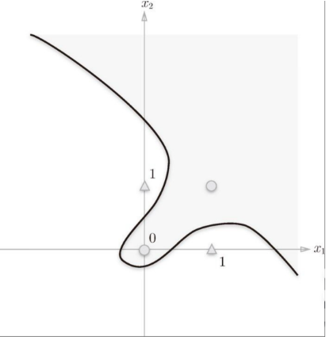
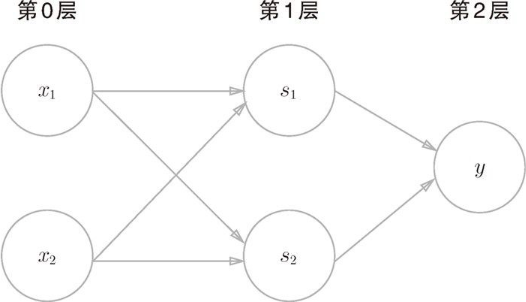

对于一个入门人工智能的小白来说，自己动手实现一个感知机对后续单层神经网络和多层神经网络的学习非常有帮助！

## 单层感知机

### 与门

> x1, x2 均为 1 时，output ： 1
#### 真值表
| x1 | x2 | y |
| -- | -- | - |
| 0  | 0  | 0 |
| 0  | 1  | 0 |
| 1  | 0  | 0 |
| 1  | 1  | 1 |
#### 代码实现
```python
import numpy as np
def AND(x1, x2):
    w = np.array([0.5, 0.5])
    x = np.array([x1, x2])
    b = -0.7  # b是被称为偏置的参数，用于控制神经元被激活的容易程度
    #     if b + w * x <= 0:
    '''
    你用上述的 if 不对，因为 w * x 之后还是一个数组！
    '''
    if b + sum(w * x) <= 0:
        return 0
    else:
        return 1
AND(1, 0)
---
output: 1
```

当x1, x2 都是真（即1）时，才输出 1

### 与非门

> 与门的取反
#### 真值表
| x1 | x2 | y |
| -- | -- | - |
| 0  | 0  | 1 |
| 0  | 1  | 1 |
| 1  | 0  | 1 |
| 1  | 1  | 0 |
#### 代码实现
```python
def NAND(x1, x2):
    x = np.array([x1, x2])
    w = np.array([-0.5, -0.5])
    b = 0.7
    tmp = b + sum(x * w)
    if tmp <= 0:
        return 0
    else:
        return 1
NAND(1, 1)
---
output: 0
```

即与们取反

### 或门

> x1, x2 有一个为 1 ，output：1
#### 真值表
| x1 | x2 | y |
| -- | -- | - |
| 0  | 0  | 0 |
| 0  | 1  | 1 |
| 1  | 0  | 1 |
| 1  | 1  | 1 |
#### 代码实现
```
def OR(x1, x2):
    x = np.array([x1, x2])
    w = np.array([0.5, 0.5])
    b = -0.2
    tmp = b + sum(x * w)
    if tmp <= 0:
        return  0
    else:
        return 1
```

在这里我们就得注意权重 `b`的范围了，因为如果`b`的范围设置不当，就会导致实际输出值与理论值完全不符！

在这里，`b`的范围为：`-0.5 < b < 0`，这个范围时完全没问题的！

<div style="background-color: #f3e5f5; border-left: 4px solid #9c27b0; padding: 10px 15px; border-radius: 4px; margin: 8px 0;">
	b是被称为偏置的参数，用于控制神经元被激活的容易程度
</div>

接下来我们看一下或门的图像


以上三个感知机，均是两个输入值，经过权重，产生输出值。


### 异或门

> 当且仅当 x1, x2 中有一个为 1 时，output：1
#### 真值表
| x1 | x2 | y |
| -- | -- | - |
| 0  | 0  | 0 |
| 0  | 1  | 1 |
| 1  | 0  | 1 |
| 1  | 1  | 0 |

在这里，我们不妨先看一下其图像：



由上图可见，其时非线性图像，我们似乎无法用简单的布尔运算类实现这个感知机，那么通过观察，

我们可以通过使用 或门 和 与非门 来实现这个感知机
#### 代码实现
```python
def XOR(x1, x2):
    a = OR(x1, x2)
    b = NAND(x1, x2)
    return AND(a, b)
```

这个感知机，使用过两个单层感知机来实现的，如图：




当你实现完 与门、与非门、或门 的时候，你会发现，从 input --- > output 仅用几行控制语句就可以实现，并且其仅有2层（输入层、输出层），
但是当你实现 异或门的时候，它并不能仅用 控制语句 就可以实现，你就得通过调用 或门 和 与非门 来实现 异或门 的函数体来实现他。
这时，他就由单层感知机 变成了 多层感知机（三层，输入层、隐藏层、输出层）。

## 感悟

通过动手实现这四个感知机，让我**通过直线理解二分类**，也让我更好地理解了多层神经元到底是怎么回事，让我们在入门深度学习的时候，不再感到无比抽象且难以理解。

回想大一下我在看这本书的时候，特别快的就看完了，感觉特别简单，哈哈！但是基本没有任何感悟，但是当我大二上再次打开这本书并且一步一步的跟着作者去实现里面的代码的时候，感受颇深！这就告诉我们：我们的认知会随着我们的知识储备的提升不断提升，而我们的知识储备（在计算机方面给）：包括但不限于**数学**、**计算机系统基础**、**数据结构与算法**这些对我们人工智能的发展都十分重要，当然**工程能力**也是必不可少的！